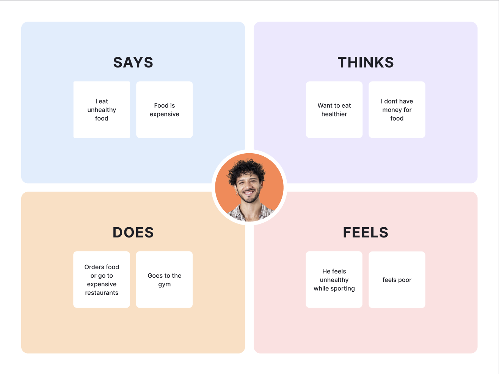

# Fase 1: Empathize (Begrijp de gebruiker)

  

## 1. Doelgroeponderzoek

* **Wie is onze gebruiker?** [Jongeren die niet zelf koken, maar vooral eten halen]

* **Pijnpunten (Pains):**

* *[Bijv: Te weinig geld door dure bezorgdiensten]*
* *[Te weinig tijd om te koken]*
* *[Ongezond eten vaker consumeren dan gezonde voedselwaren]

* **Behoeftes (Gains):**

* *[Bijv: Gezond willen eten, maar het mag max 20 minuten duren]*
* *[Goedkoper voedselwaren halen]*
* *[Plezier in het eten hebben]*
  

## 2. Empathy Map (Visueel)

  

## 3. Conclusie

*Wat is het belangrijkste inzicht dat we meenemen naar de Define fase?*

Dat mensen manieren moeten vinden om zelf de motivatie te geven om te koken met plezier aan zichzelf en minder geld spenderen aan eten buiten
