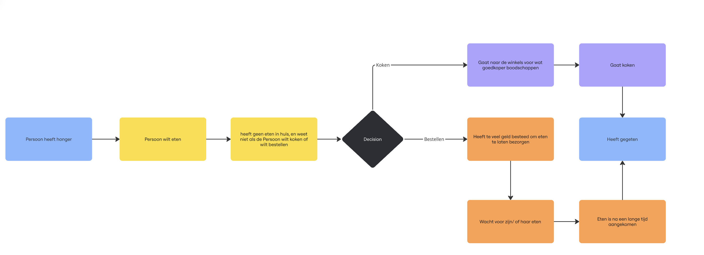

# Fase 3: Ideate (Oplossingen bedenken)

  

## 1. Concepten

* **How-Might-We vraag:** [Vul in]

1. Focus op een 'gezonde' ontsnapping (Positief effect)

Dit template helpt om jongvolwassenen een constructieve manier te bieden om te ontspannen.
Hoe kunnen we jongvolwassenen helpen om op een gezonde manier te ontsnappen aan de dagelijkse druk, zodat ze mentaal weer opladen?

2. Focus op de oorzaak (Ombuigen van het pijnpunt)

Dit template richt zich op de reden waarom ze willen ontkomen (bijvoorbeeld stress of prestatiedruk).
Hoe kunnen we de prestatiedruk in het leven van jongvolwassenen ombuigen naar een kans voor meer rust en zelfreflectie?

3. Focus op verbinding (Alternatief bieden)

Dit template zoekt naar een manier om de behoefte aan ontkoming om te zetten in iets positiefs, zoals samenkomen.
Hoe kunnen we de behoefte aan ontkoming onder jongvolwassenen gebruiken om betekenisvolle verbindingen met anderen te creëren?

  

## 2. Conceptkeuze & Onderbouwing

*Welk concept gaan we bouwen en waarom sluit dit het beste aan bij de PvE uit de Define fase?*

  

## 3. User Flow (Visueel)

